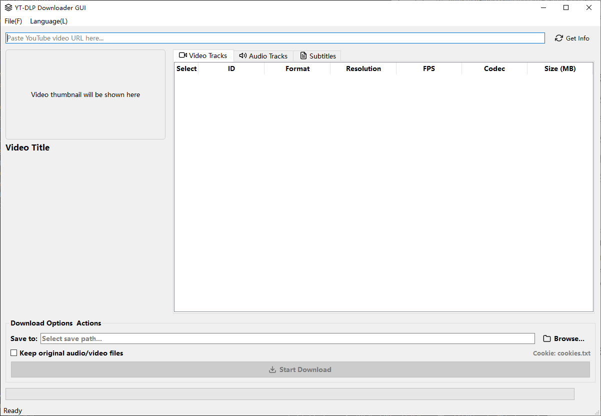
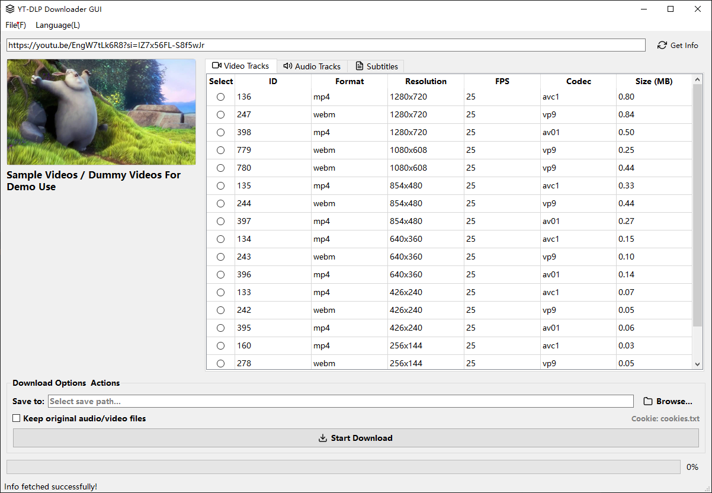
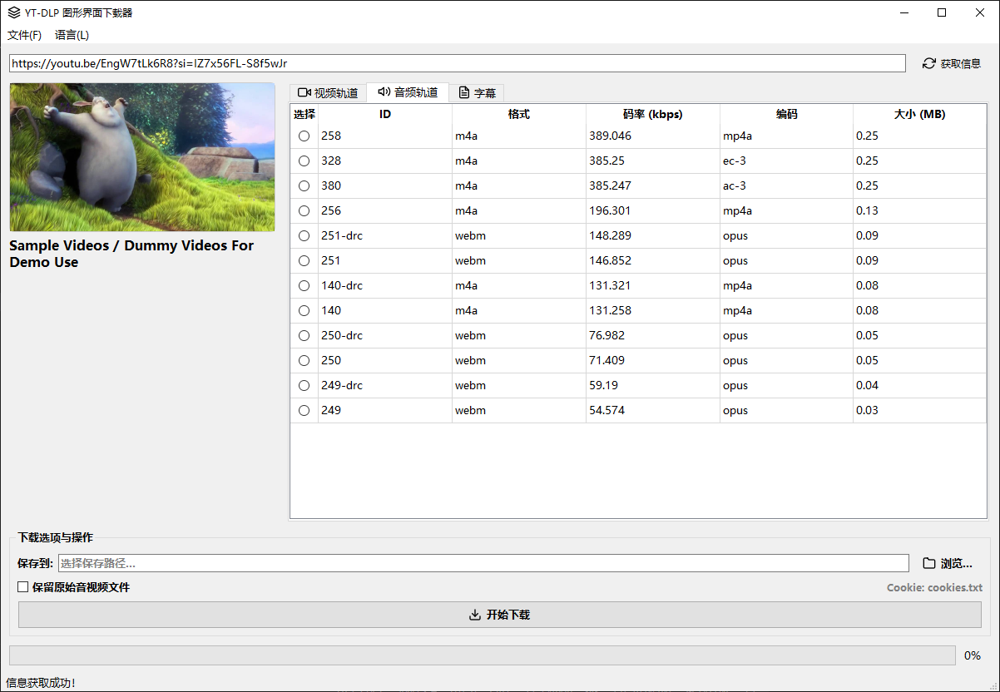
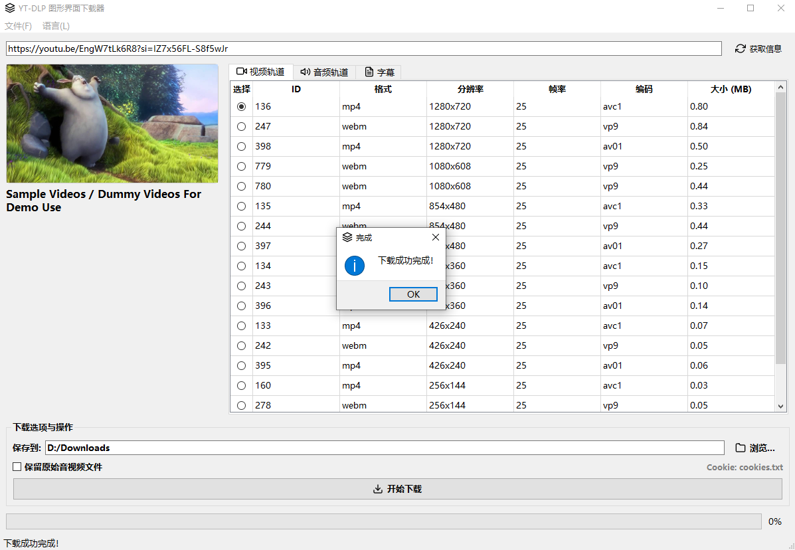

# YT-DLP 图形界面下载器 - 使用说明

欢迎使用 YT-DLP 图形界面下载器！

本应用为您提供了一个直观、易用的图形化界面，以调用强大的 [yt-dlp](https://github.com/yt-dlp/yt-dlp) 工具来下载网络视频、音频、封面及字幕，免去了记忆和输入复杂命令行的烦恼。

[](https://github.com/ezatgz/yt-dlp-gui/releases/latest)






## ✨ 主要功能

* **全面的信息解析**: 粘贴视频链接后，可一键获取视频的详细信息。
* **精细的轨道选择**: 在独立的选项卡中清晰地列出所有可用的视频、音频及字幕轨道，并显示分辨率、码率、编码等详细参数。
* **灵活的下载选项**:
    * 自由选择一个高清视频轨道和一个高品质音频轨道进行合并。
    * 支持多选字幕文件（包括人工字幕和自动生成字幕）进行下载。
    * 支持下载视频封面。
* **持久化设置**: 提供设置对话框，可保存 **FFmpeg** 和 **Cookie 文件**的路径，一次配置，长期有效。
* **高级下载控制**: 可选择在合并音视频后，是否保留原始的、独立的音视频文件，方便二次编辑。
* **多语言界面**: 支持在菜单栏中动态切换界面语言（如简体中文、English），并自动保存您的选择。

---

## 🚀 快速上手

### 1. 环境准备

在运行本应用前，请确保您的电脑已安装以下环境和库：

* **Python 3**: [Python官网](https://www.python.org/)
* **必要的 Python 库**:
    ```bash
    pip install PySide6 yt-dlp requests
    ```

### 2. 关键依赖配置 (首次使用必需)

本应用依赖两个外部工具来解锁全部功能：**FFmpeg** 和 **Cookies**。请通过 `文件` -> `设置` 菜单进行配置。

#### **🔴 FFmpeg 的设置 (必需)**

* **作用**: **FFmpeg 是合并音视频的核心工具**。如今，为了提供最高质量的画质和音质，YouTube 等网站通常将视频画面和声音作为两个独立的流提供。本应用下载的正是这种分离的高清视频和高品质音频，而将它们合并成一个我们常见的可播放视频文件（如MP4）的过程，就必须由 FFmpeg 来完成。**如果没有正确配置 FFmpeg，您将无法下载和合并视频**。

* **如何设置**:
    1.  **下载**: 前往 [FFmpeg 官网下载页面](https://ffmpeg.org/download.html)。推荐选择标记为 `full_build` 的版本。
    2.  **解压**: 将下载的压缩包解压到一个您方便查找的位置（例如 `D:\tools\ffmpeg`）。
    3.  **定位文件**: 打开解压后的文件夹，进入 `bin` 目录，找到 `ffmpeg.exe` (Windows) 或 `ffmpeg` (Linux/macOS) 文件。
    4.  **在应用中配置**: 打开本应用的 `文件` -> `设置` 对话框，点击 "FFmpeg 路径" 旁边的 "浏览..." 按钮，然后选择并打开您在上一步中找到的 `ffmpeg.exe` 文件。
    5.  **保存**设置。

#### **🔵 Cookies 的设置 (可选但强烈推荐)**

* **作用**: **Cookie 文件用于身份验证，让 yt-dlp 模拟您已登录的浏览器会话**。这在以下场景中至关重要：
    * 下载有年龄限制的内容。
    * 下载设置为“私有”或“不公开”的您自己的视频。
    * 下载您已购买的会员专属内容或付费视频。
    * 避免某些网站弹出“人机验证”导致下载失败。

* **如何设置**:
    1.  **安装浏览器插件**: 为您的浏览器（如 Chrome, Firefox）安装一个可以导出 Cookie 的插件。推荐使用名为 **"Get cookies.txt"** 或 **"Cookie-Editor"** 的插件。
    2.  **导出 Cookie**: 访问您需要下载视频的网站（如 youtube.com），并确保您已登录账号。然后点击插件图标，选择导出 Cookie，并将其保存为一个 `cookies.txt` 文件。
    3.  **在应用中配置**: 打开本应用的 `文件` -> `设置` 对话框，点击 "Cookie 文件路径" 旁边的 "浏览..." 按钮，选择并打开您刚刚导出的 `cookies.txt` 文件。
    4.  **保存**设置。

---

### 3. 使用流程

1.  **运行程序**:
    ```bash
    python main.py
    ```
2.  **粘贴链接**: 将您想下载的视频 URL 粘贴到顶部的输入框中。

3.  **获取信息**: 点击“获取信息”按钮，程序会自动解析链接，并在界面上显示视频封面、标题和所有可用的轨道。

4.  **选择轨道**:
    * 在“视频轨道”和“音频轨道”选项卡中，分别使用**单选按钮**选择您想要的一个视频流和一个音频流。建议选择分辨率最高和码率最高的。
    * 在“字幕”选项卡中，使用**复选框**选择一种或多种您想下载的字幕。

5.  **设置输出**:
    * 点击“浏览...”按钮选择您想保存文件的本地文件夹。
    * 如果需要保留独立的音视频文件，请勾选“保留原始音视频文件”。

6.  **开始下载**: 点击“开始下载”按钮。底部的进度条和状态栏会实时显示下载进度和速度。

7.  **切换语言 (可选)**:
    * 点击菜单栏的 `语言 (Language)` 选项。
    * 选择您偏好的界面语言，界面将立即刷新。您的选择会在下次启动时被记住。

## ❓ 常见问题

* **提示“FFmpeg 未找到”**:
    * 请确保您已下载 FFmpeg，并在 `文件` -> `设置` 中正确配置了 `ffmpeg.exe` 的完整路径。
* **获取信息失败或下载失败**:
    * 检查您的网络连接是否正常。
    * 检查视频 URL 是否正确。
    * 尝试配置并使用 `cookies.txt` 文件，特别是对于有访问限制的视频。

---

希望这款工具能为您带来便利！
